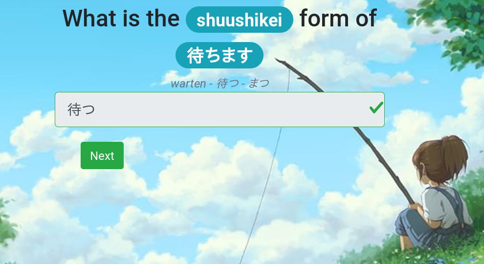

# Japanese word form trainer

A little japanese trainer app for people who know hiragana and the different word forms (currently only verbs) and now want to practice converting between these forms.

Verb forms are: Mizenkei, Shikokei, Renyoukei, Shushikei/Rentaikei, Kateikei and Meireikei (not yet supported)&ast;

* See the table on this [German wikipedia page](https://de.wikipedia.org/wiki/Japanische_Grammatik#Flexion_und_Konjugation) for more information

## Online

Deployed on github.io: [https://aklakan.github.io/japanese-word-forms-trainer](https://aklakan.github.io/japanese-word-forms-trainer)




## Building
This project uses Webpack 4 and Vue.js 2.

Prerequisites: You need to have a working setup of `npm` (node package manager).

* Download all dependencies

```
npm install
```

* Development build, starts an embedded web server that serves this project and conveniently shows it in the browser

```
npm run dev
```

* Production build. Output is placed into the `dist` folder. [This config](config/webpack.config.prod.js) is used; the publicPath property likely needs to be adjusted for custom deployments.

```
npm run build
```

* Deployment to gh-pages branch

```
npm run deploy
```

## Credits go to...

* ... Dennis Knopf-sensei for assembling the exercise data
* ... the highly talented artist [Djamila Knopf](http://www.djamilaknopf.com/); the background image in this project is used with her permission
* ... This [blog post by Samuel Teboul](https://medium.com/js-dojo/how-to-configure-webpack-4-with-vuejs-a-complete-guide-209e943c4772) for giving me a kick start in setting up a modern web app project

